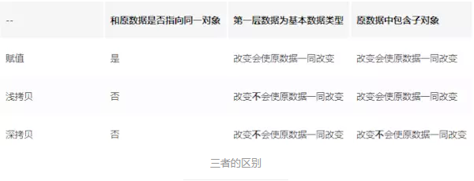
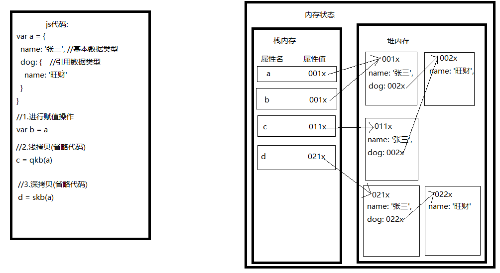

# JS

#### 1.js简介

​	 DCOMAScript DOM BOM 

#### 2.构造函数

##### 	1.构造函数定义

​		--创建一个构造函数，专门用来创建Person对象的

​		--构造函数就是一个普通的函数，创建方式和普通函数没有区别

​		--不同的是构造函数习惯上首字母大写

​		--构造函数和普通函数的区别就是调用方式的不同

​		--普通函数是直接调用，而构造函数需要使用new关键字来调用

​		--构造函数的执行流程：

​			a.立刻创建一个新的对象

​			b.将新建的对象设置为函数中this,在构造函数中可以使用this来引用新建的对象

​			c.逐行执行函数中的代码

​			d.将新建的对象作为返回值返回


​		--使用同一个构造函数创建的对象，我们称为一类对象，也将一个构造函数称为一个类。

​		--我们将通过一个构造函数创建的对象，称为是该类的实例

##### 	2.this的情况：

​		--当以函数的形式调用时，this是window

​		--当以方法的形式调用时，谁调用方法this就是谁

​		--当以构造函数的形式调用时，this就是新创建的那个对象

##### 	3.instanceof

​	使用instanceof可以检查一个对象是否是一个类的实例

##### 	4.构造函数的问题

​		1.问题:占用内存空间

​			在Person构造函数中，为每一个对象都添加了一个sayName方法，
​			目前我们的方法是在构造函数内部创建的，
​				也就是构造函数每执行一次就会创建一个新的sayName方法
 			也是所有实例的sayName都是唯一的。

​			这样就导致了构造函数执行一次就会创建一个新的方法，
​				执行10000次就会创建10000个新的方法，而10000个方法都是一摸一样的
​				这是完全没有必要，完全可以使所有的对象共享同一个方法

​		2.解决方法:

​			将方法在全局作用域中定义
​				//谁调用this指向就是谁
​			仍然存在的问题
​				污染全局作用域

#### 3.js预编译

​	预编译阶段做的事情:

​		1.创建ao对象

​		2.找形参和变量声明,作为ao对象的属性名,值是undefined

​		3.实参和形参相统一

​		4.找函数声明,会覆盖变量的声明

```js
function fn(a,c) {
    console.log(a) 	//输出: function a() {}
    console.log(c)	//输出: function c() {}
    function a() {}
    function c() {}
}
fn(1,2)
//1
AO: {
    //2,3,4
    a: undefined 1 function a() {} //依次覆盖
    c: undefined 2 function c() {}
}
```

#### 4.this指向问题

​	1.在函数中直接使用 (指向 window)

​	2.函数作为对象的方法被调用 (谁调用就指向谁)

​	3.箭头函数没有自己的this, 它的this指向继承父级, 即上一个闭包(ES5)或代码块(ES6)的this,如果都没有才指向window

#### 5.js作用域

​	0.作用域原理: 

​		在函数代码执行前 会预编译 创建一个执行期上下文对象 AO(作用域)

​		在全局代码执行前会创建一个执行期上下文对象 GO(作用域)

​	全局作用域

​		预编译:

​		1.创建GO对象

​		2.找变量声明 将变量名作为GO对象的属性名 值为undefined

​		3.找函数声明 值赋予函数体

​	函数作用域

​		预编译:

​		1.创建AO对象

​		2.找形参和变量声明 作为AO对象的属性名 值是undefined

​		3.实参和形参相统一

​		4.在函数体里面找函数声明 值赋予函数体

​	块级作用域(ES6)

```js
AO: {
    a: undefined 1 function a() {}
    c: undefined 2 function c() {}
    b: undefined   
    d: undefined
}
```

​	声明提前：
​	变量和函数都是--先声明(var function)，后赋值(=)

```js
alert("a = " + a);	
var a = 20; 
//以上代码浏览器解析如下：
var a;		
alert("a = " + a);	//所以输出结果为:a = undefined
a = 20;
```

​	1.全局作用域（变量作用范围为全局）

​		--全局作用域在页面打开时创建，在页面关闭时销毁

​		--window对象是全局对象，也是最大的对象	
​			所有的变量都是window的属性，所有的函数都是window的方法

```js
function fun(){};		//===>window.fun();
a = 10;  				//===>window.a = 10;不用var声明的变量都会成为全局变量(即使它在函数中)
```

​	2.函数作用域	

​		--调用函数时创建函数作用域，函数执行完毕以后，函数作用域销毁

​		--在全局作用域中无法访问到函数作用域的变量（var声明的）

​		--在函数中要访问全局变量可以使用window对象（Eg.	window.a）	

```js
var a = 1;
function fun1(){
    var a = 10;
    //要访问全局变量的a 
    console.log(window.a);	===>1

    console.log(a);			===>10
}
```

​		--定义形参就相当于在函数作用域中声明了变量	

​	3.总结——作用域模型

```js
window{				//window是全局对象
    var a = 10;		//全局变量						即window的属性 相当于window.a=10；
    function(){		//函数 							即window的方法 相当于 window.function();
        var b = 20;		//局部变量						在函数范围内有效
        c = 30;			//未用var声明的变量视为全局变量	即window.c = 30;
    }
    alert()				相当于	window.alert();
    document.write()	相当于	window.document.write();
}
```

#### 8.闭包的底层理解

​	1.作用域链

```js
scopeChain: [
	AO: {
    	a: 123
    	b: function
    },
    GO: {
        global,
        a: function
    }
]
```

​	2.闭包创建函数作用域, 一直存在内存中 可以被全局访问 用来封装方法

#### 9.防抖函数

```js
debounce(func, delay) {
    let timer = null
    return function (...args) {
        if (timer) clearTimeout(timer)
        timer = setTimeout(() => {
            func.apply(this, args)
        }, delay)
    }
}
```

#### 10.节流函数

```js
function throttle(func, wait) {
    let timeout

    return function() {
        if (!timeout) {
            timeout = setTimeout(() => {
                timeout = null
                func.call(this, arguments)
            }, wait)
        }
    }
}
```

#### 11.图片懒加载原理

​	1.设置图片路径为空或占位图

​	2.当图片offsetTop < 可见高度 + 滚动高度时(图片出现在屏幕中) 将图片的路径进行更换

​	3.使用防抖和节流函数

#### 12.事件循环 

​	1.一般情况下,js代码逐行编译运行, 将函数压入调用栈中 调用一个函数就清除一个函数

​	2.异步操作: fetch setTimeout setInterval 会将消息压入到消息队列中 待调用栈清空 再调用消息栈

​	3.异步操作: promise async await 的异步操作时会加入到微任务中去 会在调用栈清空时立即执行 调用栈中的微任务会立马执行

​	执行优先级: 调用栈 > 微任务 > 消息栈

#### 13.BFC 块级格式化上下文

​	开启BFC是解决的问题: 

​		1.高度塌陷问题

​		2.阻止元素被浮动元素覆盖

​	开启BFC的方式: 

​		1.开启浮动

​		2.position: absolute 或 fixed

​		3.display: inline-block 或 flex 或 inline-flex

​		4.overflow: hidden

#### 14.深浅拷贝

​	1.栈内存和堆内存

​	2.赋值和浅拷贝的区别

​		1.浅拷贝需要创建一个新的对象

​		2.拷贝的值: 对象内部的 基本数据类型的值或引用数据类型的内存地址 即只复制栈内存中的内容

​		3.浅拷贝如果遇到的是引用数据类型 拷贝前后是互相影响的

</img>

</img>

​	3.深浅拷贝的代码

```js
//浅拷贝源码
function shallowCopy(src) {
   var dst = {};
   for (var prop in src) {
       if (src.hasOwnProperty(prop)) {
           dst[prop] = src[prop];
       }
   }
   return dst;
}
//浅拷贝方法 Object.assign() | Array.prototype.concat() | Array.prototype.slice()
var initalObj = Object.assign({}, obj); //对象浅拷贝
let arr2=arr.concat(); //数组浅拷贝
let arr3 = arr.slice();//数组浅拷贝

```

​		深拷贝方法: 1. JSON.parse(JSON.stringify())

```js
let arr4 = JSON.parse(JSON.stringify(arr)); //这种方法虽然可以实现数组或对象深拷贝，但不能处理函数。
```

​		2.手写递归方法:	

​			原理：遍历对象、数组直到里边都是基本数据类型，然后再去复制，就是深度拷贝。

```js
   // 定义检测数据类型的功能函数
   function checkedType(target) {
     return Object.prototype.toString.call(target).slice(8, -1)
   }
   // 实现深度克隆---对象/数组
   function clone(target) {
     // 判断拷贝的数据类型
     // 初始化变量result 成为最终克隆的数据
     let result, targetType = checkedType(target)
     if (targetType === 'object') {
       result = {}
     } else if (targetType === 'Array') {
       result = []
     } else {
       return target
     }
     // 遍历目标数据
     for (let i in target) {
       // 获取遍历数据结构的每一项值。
       let value = target[i]
       // 判断目标结构里的每一值是否存在对象/数组
       if (checkedType(value) === 'Object' ||
         checkedType(value) === 'Array') { //对象/数组里嵌套了对象/数组
         // 继续遍历获取到value值
         result[i] = clone(value)
       } else { 
        // 获取到value值是基本的数据类型或者是函数。
         result[i] = value;
       }
     }
     return result
   }

   // 定义检测数据类型的功能函数
   function checkedType(target) {
     return Object.prototype.toString.call(target).slice(8, -1)
   }
   // 实现深度克隆---对象/数组
   function clone(target) {
     // 判断拷贝的数据类型
     // 初始化变量result 成为最终克隆的数据
     let result, targetType = checkedType(target)
     if (targetType === 'object') {
       result = {}
     } else if (targetType === 'Array') {
       result = []
     } else {
       return target
     }
     // 遍历目标数据
     for (let i in target) {
       // 获取遍历数据结构的每一项值。
       let value = target[i]
       // 判断目标结构里的每一值是否存在对象/数组
       if (checkedType(value) === 'Object' ||
         checkedType(value) === 'Array') { 
          // 对象/数组里嵌套了对象/数组
          // 继续遍历获取到value值
         result[i] = clone(value)
       } else { 
         // 获取到value值是基本的数据类型或者是函数。
         result[i] = value;
       }
     }
     return result
   }

```

​		3.函数库lodash

```js
var _ = require('lodash');
var obj2 = _.cloneDeep(obj1);
```

#### 15.symbol 表示唯一值

#### 16.原型(prototype)	

​	1.认识原型对象
​	原型属性名:__proto__
 	我们所创建的每一个函数，解析器都会向函数中添加一个属性prototype
​		这个属性对应着一个对象，这个对象就是我们所谓的原型对象
​	如果函数作为普通函数调用prototype没有任何作用
 	当函数以***构造函数***的形式调用时，它所创建的对象中都会有一个隐含的属性，
​		指向该构造函数的原型对象，我们可以通过__proto__来访问该属性

原型对象就相当于一个公共的区域，所有同一个类的实例都可以访问到这个原型对象，
	我们可以将对象中共有的内容，统一设置到原型对象中。

 当我们访问对象的一个属性或方法时，它会先在对象自身中寻找，如果有则直接使用，
	如果没有则会去原型对象中寻找，如果找到则直接使用...

以后我们创建构造函数时，可以将这些对象共有的属性和方法，统一添加到构造函数的原型对象中，
这样不用分别为每一个对象添加，也不会影响到全局作用域，就可以使每个对象都具有这些属性和方法了

```js
//为对象的原型对象添加方法
//构造函数名.prototype.方法名(){
//
//};
Person.prototype.fun1(){
//alert("");
}
```

2.原型链
	引言
		1.用 in检查某个对象中是否有某个属性,但无法区分其是自身还是原型中的属性
		2.用 hasOwnProperty("") "有自身的属性" 来检查自身是否有某个属性
		3.查找hasOwnProperty属性在哪里//找手机
			1.在对象里找//在自己房间里找
				console.log(fun1.hasOwnProperty("hasOwnProperty"))	==>false//找不到
			2.在对象的原型里找//在爸爸房间里找
				console.log(fun1.__proto__.hasOwnProperty("hasOwnProperty"))	==>false//找不到
			3.在对象的原型的原型里找//在爷爷的房间里找
				console.log(fun1.__proto__.__proto__.hasOwnProperty("hasOwnProperty"))	==>true//找到了
			4.思考:对象的原型的原型还有原型吗?//我可以到祖父的房间里找手机吗?
				console.log(fun1.__proto__.__proto__.proto__)	==>null
	结论
		原型对象也是对象，所以它也有原型，
			1.当我们使用一个对象的属性或方法时，会先在自身中寻找，自身中如果有，则直接使用，
			2.如果没有则去原型对象中寻找，如果原型对象中有，则使用，
			3.如果没有则去原型的原型中寻找,直到找到Object对象的原型，
			4.Object对象的原型没有原型，如果在Object原型中依然没有找到，则返回undefined

#### 17.正则表达式	RegExp

​	1.正则表达式用于定义一些字符串的规则

```js
语法 var 变量 = new RegExp("正则表达式","匹配模式");
Eg.	var reg = new RegExp("ab","i");//i忽略大小写,g全局匹配
```

​	2.正则表达式的方法：

```js
test() //使用这个方法可以用来检查一个字符串是否符合正则表达式的规则==>true,false
```

​	3.使用字面量来创建正则表达式

```js
语法：var 变量 = /正则表达式/匹配模式
Eg.	var reg = /a/i;
```

​	4.其它字面量	

```js
a|b		a或b
[ab]	a或b
[a-z]	任意小写字母
[A-Z]	任意大写字母
[A-z]	任意字母
[0-9]	任意数字
[^ab]	除了ab
```

​	5.正则表达式的相关方法

```js
splite()//将一个字符串以指定分隔符拆分为一个数组(全部拆分)
search()//搜索字符串中是否含有指定内容(只找第一个,即使g也无效)
match()//提取指定内容并封装为一个数组
replace(old,new)//将字符串中指定内容替换为新的内容

*方法可以嵌套使用
Eg.	str.split("").reverse().join("");
```

​	6.量词
​		1.通过量词可以设置一个内容出现的次数,
​			量词只对它前边的一个内容起作用

```js
{n}		//正好出现n次
{m,n}	//出现m-n次
{m,}	//m次以上

+ 	//至少1次,相当于{1,}
* 	//任意次,相当于{0,}
?		//0-1次,相当于{0,1}
^a	//以a开头
a$	//以a结尾

var reg = /(abc){3}/;//用()圈分出一个整体,==>出现3次abc
```

​	7.字符		

```js
 .	//表示任意字符
\.	//==>.,\表示转义字符

\w	//任意字母数字下划线[A-z0-9]
\W	//除了字母数字下划线[^A-z0-9]
\d	//任意数字[0-9]
\D	//除了数字[^0-9]
\s	//空格
\S	//除了空格

\b	//单词边界
Eg.	reg = /\bchild\b/;
\B	//除了单词边界
```

​	8.邮件的正则		