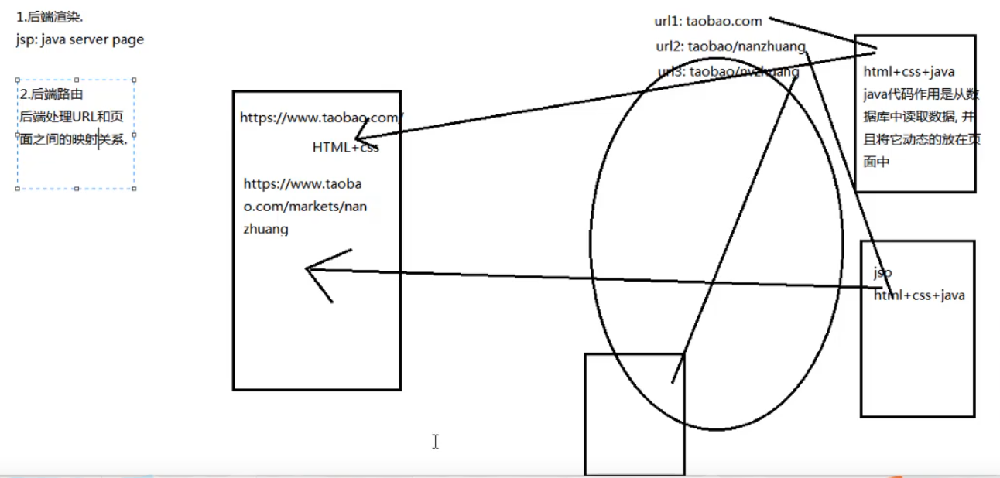
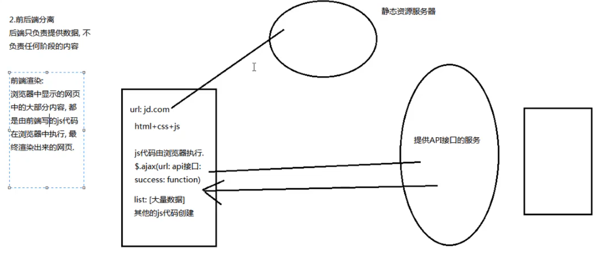
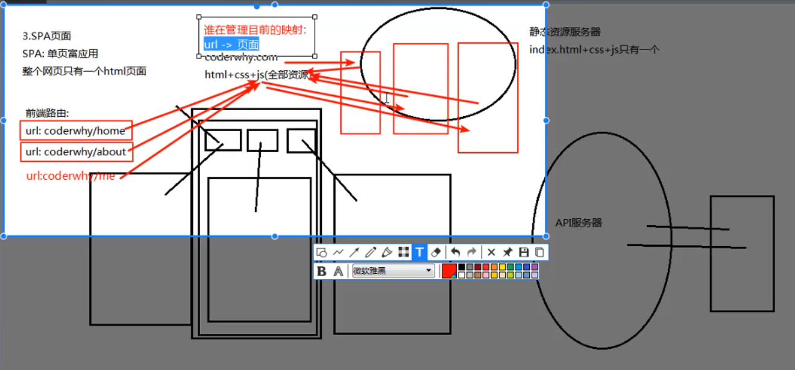
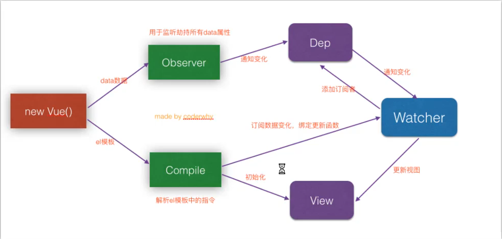
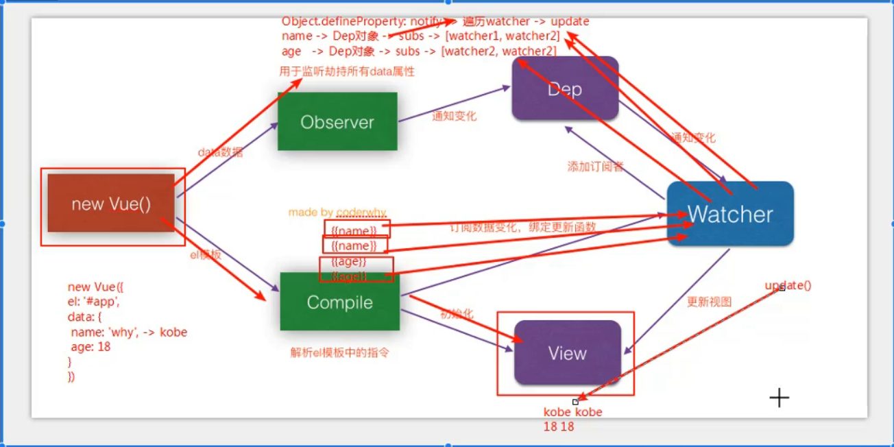

## VUE

#### 1.Vue.js安装

​    1.cdn引入
​    2.vue官网下载
​    3.npm安装

#### 2.vue中的MVVM(Model ViewModel View)

​    详见:vue\截图\计数器MVVM.png

#### 3.了解前端渲染和后端渲染,前端路由和后端路由

  1.后端渲染和后端路由

​    </img>

​    后端渲染
​      jsp: java server page 
​    后端路由
​      后端处理url和页面之间的映射关系

  2.前后端分离(ajax)

   </img>

 

 3.单页面富应用阶段(spa)

  </img>

#### 4.别名 alias

​	给某个文件夹起别名 

​	vue2中,build/webpack.base.config.js -> resolve ->alias

​	vue3中,新建vue.config.js

```
module.exports = {
    configureWebpack: {
      resolve: {
        alias: {
          'assets': '@/assets',
          ...
        }
      }
    }
  }
```

#### 5.Promise

  1.Promise是异步编程的一种解决方案

  2.语法: (链式编程)

```js
new Promise((resolve, reject) => {
	//第一次网络请求代码
	setTimeout((data) => {
    //处理的代码使用resolve代替分离,跳到then
    resolve(data) //resolve可以传递实参,例: resolve('hello')
    //失败的时候调用reject,跳到catch
    reject('error message')
    },1000)
}).then((data) => {
    //第一次处理代码
    console.log('Hello Promise')
    //嵌套第二次网络请求
    return new Promise((resolve, reject) => {
    ...
    })
}).catch((err) => {
  console.log(err)
}).then(...)
```

  ?第二次网络请求错误时会一起打印第二次的请求失败和成功的两段话

  3.Promise源码解析:
    1.new -> 构造函数(1.保存了一些状态信息 2.执行传入的函数)
    2.在执行传入的回调函数时,会传入两个参数: resolve reject, 其本身又是函数

#### 6.Promise的三种状态

  pending 等待状态
  fulfill 满足状态
  rejected 拒绝状态

  1.Promise的另一种写法
    语法: .then(resolve, reject) //这是两个参数又是函数     

```js
new Promise((resolve, reject) => {
  setTimeout(() => {
    resolve('succse')
    reject('error')
  },3000)
}).then(res => {
	console.log(res)
}, err => {
	console.log(err)
})
```

#### 7.Promise的链式调用

```js
//成功:
return new Promise((resolve) => {
	resolve(data)
})
//可以简化为:
return Promise.resolve(data)
//还可以简化为:
return data
//拒绝:
return new Promise((reject) => {
	reject('error message')
})
//可以简化为:
return Promise.reject('error message')
//还可以简化为:
throw 'error message'
```

#### 8.Promise.all方法使用

```js
//语法: 
Promise.all([
	new Promise((resolve, reject) => {

	}),
new Promise(...)
...

]).then(results => {
	console.log(results) //results是个数组
})
```

#### 9.Vue响应式原理-代码

  1.Vue内部是如何监听数据的改变?
    Object.defineProperty -> 监听对象属性的改变


  2.当数据发生改变,Vue是如何知道通知谁,界面发生刷新?
    发布订阅者模式

  3.源码解析: 

```js
const obj = {
  message: 'hello vue'
  name: 'xiao ming'
}
//监听对象属性的改变 Observe
Object.keys(obj).forEach(key => {
  let value = obj[key]
  Object.defineProperty(obj, key, {
    set(newValue) {
      //监听key的改变
      value = newValue
    },
    get() {
      //获取key的值
      return value
    }
  })
})
//发布订阅者模式
```


#### 10.Vue响应式原理-图解

</img>

</img>

#### 11.Vue响应式原理-源码具体原理

  0.创建Vue类

  1.保存数据(options, data, el)

  2.将data添加到响应式系统中(Observer)
    dep: subs, addSub(sub)订阅者, notify() -> 遍历sub.update() -> get() ->...
    Object.defineProperty()监听属性变化
      get() -> dep.addSub(wacher) //获取属性值时调用
      set() -> dep.notify()       //属性值发生变化时调用

  //3.代理this.$data的数据
    _proxy(), Object.defineProperty()

  4.处理el(Compiler)

​    0.初始化时{{data}} -> watcher -> 调用dep的addSub(watcher)方法,同时将属性值呈现在view中
​      当时属性值发生变化时,dep遍历subs数组的update()方法,update()方法将数值更新在view中

​	1.构造器
  	el/vm(vue实例)

​	2.创建片段,匹配{{}}模板

#### *.Vue展示md文件

​	1.安装 vue-markdown-loader

```undefined
npm install vue-markdown-loader  -D
```

​	2.安装 vue-loader 、vue-template-compiler

```cpp
npm install vue-loader  -D
npm install vue-template-compiler  -D
```

​	3.安装 github-markdown-css、highlight.js

```css
npm install github-markdown-css  -D
npm install highlight.js  -D
```

​	4.在vue.config.js中配置webpack

```jsx
module.exports = {
  chainWebpack: config => {
    config.module.rule('md')
      .test(/\.md/)
      .use('vue-loader')
      .loader('vue-loader')
      .end()
      .use('vue-markdown-loader')
      .loader('vue-markdown-loader/lib/markdown-compiler')
      .options({
        raw: true
      })
  }
}
```

​	5.在main.js中引入样式文件

```dart
// markdown样式
import 'github-markdown-css'
// 代码高亮
import 'highlight.js/styles/github.css'
```

​	6.在vue组件中使用

```xml
<template>
  <demo-md class="markdown-body"></demo-md>
</template>

<script>
import DemoMd from './demo.md';
export default {
  components: {
    DemoMd
  }
}
</script>
```

#### 12.watch

  监听某个属性的改变
  语法: watch:{property(newValue,oldValue){}}

```
watch: {
  property1(newValue){
    this.property1 = newValue * 100;
    this.$emit(property1change,newArr);
  }
}
```

  Eg. vue\practice\33父子组件传递案例-watch.html

#### 13.scss安装方式

​	1.vue安装时选择安装sass和sass-loader

​		"sass": "^1.26.5",

​		"sass-loader": "^8.0.2",

​		修改elment-ui原生样式时,直接使用 .el-input  .el-input__inner

​	2.安装node-sass@4.14.1

​		命令: cnpm install node-sass@4.14.1

​		缺点: 重新npm install时,node-sass可能会不生效,无论是否加--save

​		修改elment-ui原生样式时,使用 .el-input /deep/ .el-input__ inner, 但是el-input >>> .el-input__inner不生效